# nix-autoenv

nix-direnv alternative that does not need a .direnv metafile

> [!NOTE]
> nix-autoenv only works with flake projects.

> [!TODO]
> - add tests
> - nix-autoenv auto save (to make certain paths automatic)



### How to setup?

Run the following command and put the output in your shell's rc file:
```
# Fish
nix-autoenv fish-setup
# Zsh
nix-autoenv zsh-setup
# Bash
nix-autoenv bash-setup
```

#### Fully automatic use

To make nix-autoenv always automatically switch to default devShell, set the `NIX_AUTOENV_AUTO` env variable to `1`.

### How does it work?

nix-autoenv runs `nix flake info` on every cd, if it fails to run it will restore the environment,
if it succeeds, it will run `nix develop` inside `bwrap` sandbox and extracts the environment into your current shell.
